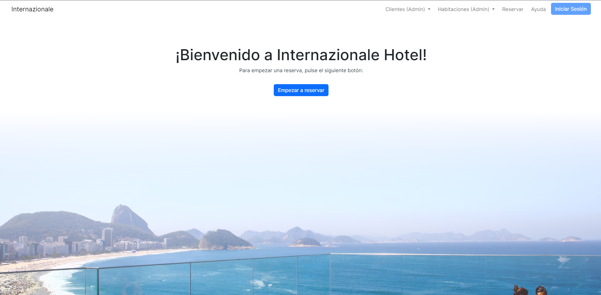

<h1 align="center"> Internazionale </h1>
<h1 align="center"> Actividades Grado Superior  👨‍🏫 </h1>

Un PMS (Sistema de Gestión Hotelera) desarrollado en PHP. Este es un proyecto de clase.

*Página de inicio*

## Cosas a tener en cuenta:
- Preparación del entorno de trabajo (localhost, remotehost) respetando las normas para nombrar ficheros y trabajar en entorno compartido.
- Crear la base de datos (rooms, customers, reservations...)

## Customer requirements vs Customer experience

### PHP Project - Bronze.

**1. Estructura:**
- [X] Crear y nombrar con criterio los formularios y ficheros de acción asociados para las tablas principales: rooms (SIUD), customers (SIUD), reservations (SIUD).

**2. UX:**
- [ ] Crear mini-formularios y distribuirlos para aprovechar las IDs del contexto y mejorar la experiencia del usuario (UX).
- [ ] Permitir que los usuarios puedan ver las habitaciones disponibles y reservarlas. (**En desarrollo**)
- [ ] Permitir la secuencia completa que espera encontrar el cliente al ir a un hotel: **Reservar, Check-in, Check-out** y **emisión de la factura correspondiente**.

**3. SEGURIDAD:**
- [ ] Crear formulario login, fichero de acción asociado e implementar Control de Usuarios por tipo (guest, customer, admin) mediante el uso de la variable superglobal de sesión. (**En desarrollo**)

**4. EXTRAS:**
- [ ] Habilitar servicios extra en el hotel (spa, bar, restaurante) y permitir que los clientes puedan adquirirlos cargándolos a la habitación. Desarrollar algún sistema para que los clientes alojados en el hotel adquieran estos servicios aleatoriamente. (**En desarrollo**)
      
### PHP Project - Silver
**6. EXTRAS:**
- [ ] Almacenar los datos de los servicios extras en un fichero JSON dentro de la base de datos y extraerlos correctamente para emitir la factura. (**En desarrollo**)

**7. RESERVAS:**
- [ ] Permitir cancelación, modificación (reducir o ampliar días), antes y durante la estancia en el hotel.

**8. FUNCIONALIDADES:**
- [ ] Permitir que el administrador suba ficheros al servidor (ej. imágenes de habitaciones o clientes -foto, dni-) mediante el formulario correspondiente. (**En desarrollo**)

### PHP Project - Gold

**9. MANUAL:**
- [ ] Elaborar un manual en línea asociado a la aplicación web realizada. (**En desarrollo**)

**10. LIBRE:**
- [ ] Sorprender con una funcionalidad WEB adicional que pueda gustar al cliente.

**11. PRESENTACIÓN:**
- [ ] Explicar funcionalidad en clase para aportar algo a los demás. Presentaciones en clase: explicar funcionalidades o conceptos interesantes que nos ha costado adquirir y que pueden ahorrar tiempo a los demás.
